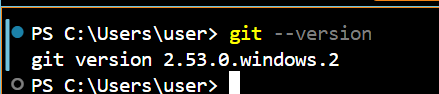
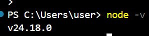
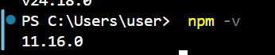
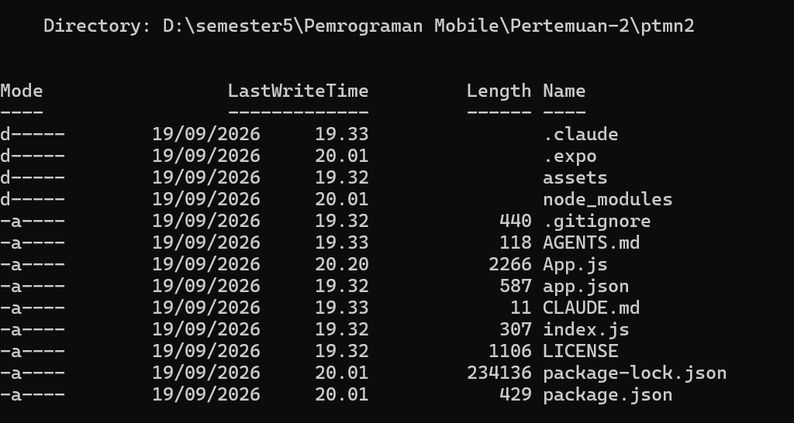
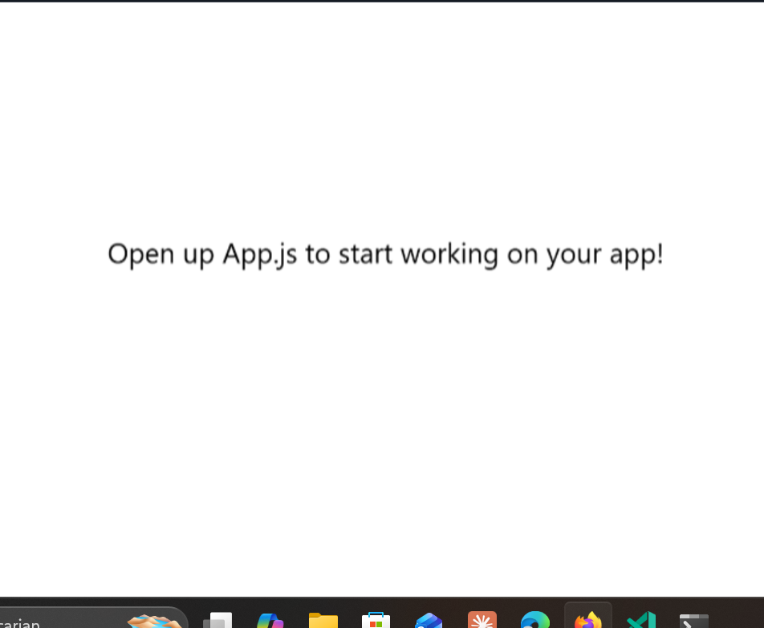
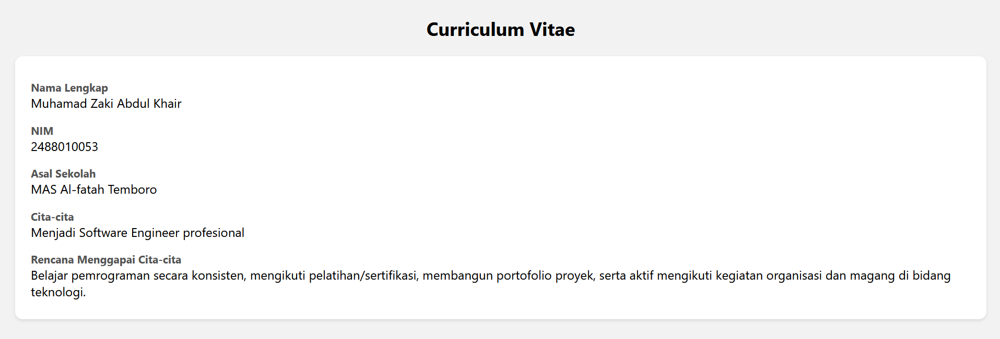

📱Praktikum Menyiapkan Lingkungan Pengembangan dan Memulai Pemrograman Mobile (React Native)
Tujuan Pembelajaran

Mahasiswa mampu :

    Menyiapkan lingkungan pengembangan dan memulai pemrograman mobile (React Native)
    Membuat aplikasi mobile dengan React Native
    Menyelesaikan Tugas CV sederhana dengan React Native

Materi dan Laporan Praktikum

    Menyiapkan lingkungan pengembangan dan memulai pemrograman mobile (React Native)

    Memastikan instalasi Git bash
        cek Instalasi Git bash (git --version)
        bukti Verifikasi alt text
        
    Memastikan Node.JS dan NPM
        Download dan Install Node.JS di https://nodejs.org/en/download/
        Konfirmasi Node.JS dan NPM (node -v, npm -v) alt text
        , 

    Membuat aplikasi / Projek baru dengan React Native Framework Expo Go

    Buka dan baca dokumentasi resmi link https://docs.expo.dev/

    Buka dan baca documentasi resmi link https://reactnative.dev/docs/getting-started

    Memulai Membuat projek baru

    open terminal change directory ke Pertemuan-2

    masukan perintah (npx create-expo-app ptmn2 --template blank)

    bukti verifikasi alt text
    

    Running Projek
        Cd ke ptmn2
        npx expo start
        Install Expo Go di Android atau IOS
        bisa juga menggunakan Web emulator di Laptop / PC
        Setelah berhentikan (ctrl + C)
        Install (npx expo install react-dom react-native-web)
        npx expo start --web
        Konfirmasi Keberhasilan
        

    Tugas Praktikum
        Membuat aplikasi CV sederhana dengan React Native
        Nama Lengkap
        NIM
        Asal Sekolah
        Cita-cita
        Rencana Menggapai cita-cita

konfirmasi keberhasilan

